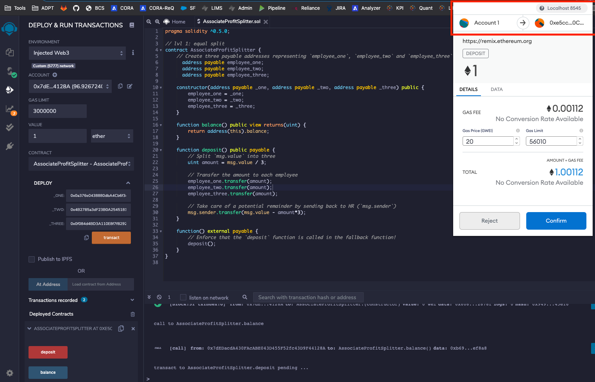

# Level One: Associate Profit Splitter

This contract will accept Ether into the contract and divide the Ether evenly among three associate level employees. This will allow the Human Resources department to pay employees quickly and efficiently.

 

### Data Dictionary:
**Three payable addresses:**
- address payable employee_one;
- address payable employee_two;
- address payable employee_three;

**function balance():**
- return the contract's current balance

**function deposit():**
- only the owner can call the function via `public payable`
- calculate the split value of the Ether between the employees
- send left over wei back to HR

**function() external payable:**
- enforce that the `deposit` function is called in the fallback function

 

#### Test the contract

Deployed the contract to my local Ganache chain by connecting to `Injected Web3` and ensuring MetaMask is pointed to `localhost:8545`.

  

#### Deploy the contracts to a live Testnet

Once you feel comfortable with your contracts, point MetaMask to the Kovan or Ropsten network. Ensure you have test Ether on this network!

After switching MetaMask to Kovan, deploy the contracts as before and copy/keep a note of their deployed addresses. The transactions will also be in your MetaMask history, and on the blockchain permanently to explore later.

