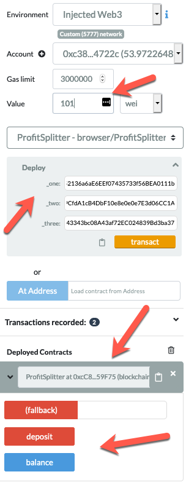

# Associate Profit Splitter

### Level One:

This contract will accept Ether into the contract and divide the Ether evenly among three associate level employees. This will allow the Human Resources department to pay employees quickly and efficiently.

### At the top of your contract, you will need to define the following `public` variables:

#### Test the contract

In the `Deploy` tab in Remix, deploy the contract to your local Ganache chain by connecting to `Injected Web3` and ensuring MetaMask is pointed to `localhost:8545`.

You will need to fill in the constructor parameters with your designated `employee` addresses.

Test the `deposit` function by sending various values. Keep an eye on the `employee` balances as you send different amounts of Ether to the contract and ensure the logic is executing properly.

### Deploy the contracts to a live Testnet

Once you feel comfortable with your contracts, point MetaMask to the Kovan or Ropsten network. Ensure you have test Ether on this network!

After switching MetaMask to Kovan, deploy the contracts as before and copy/keep a note of their deployed addresses. The transactions will also be in your MetaMask history, and on the blockchain permanently to explore later.

