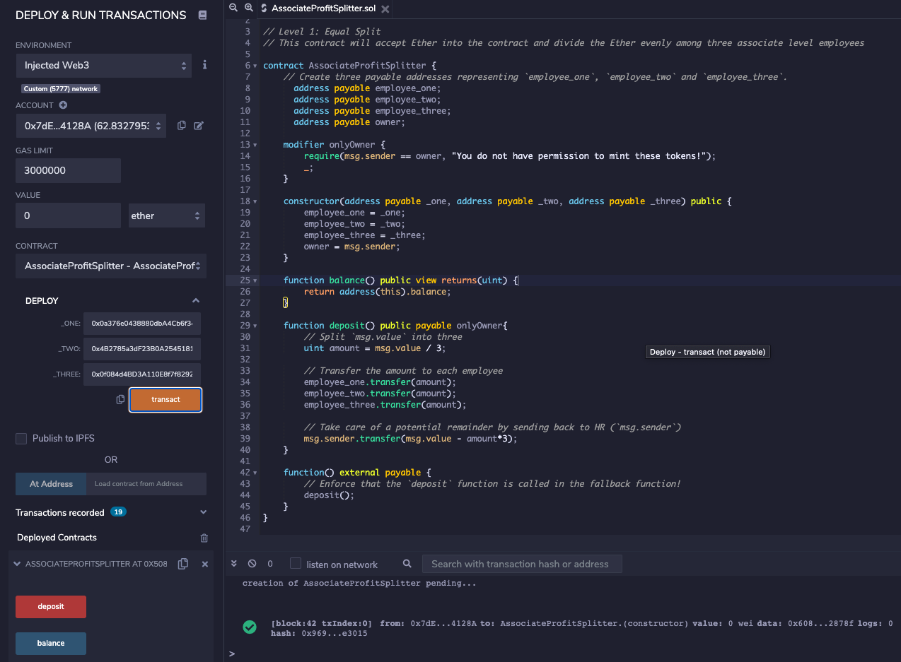
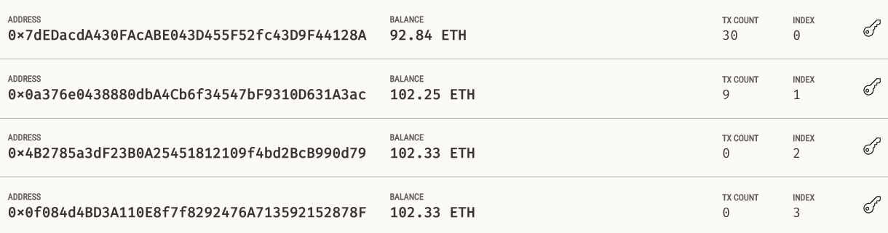
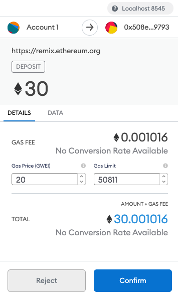
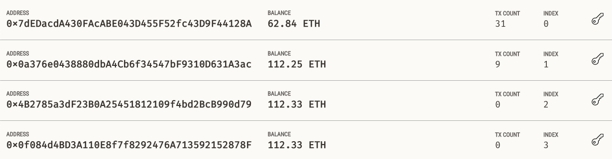
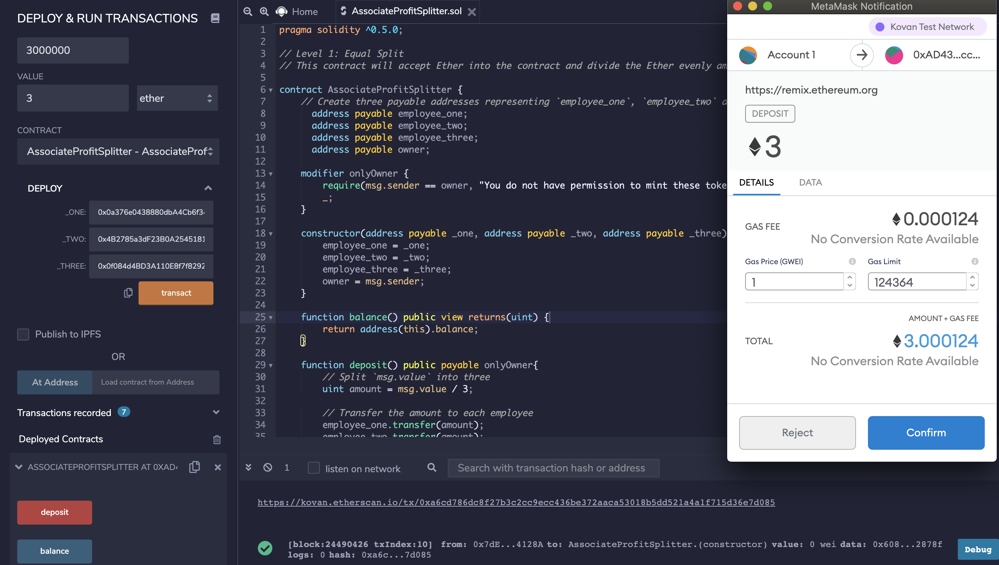
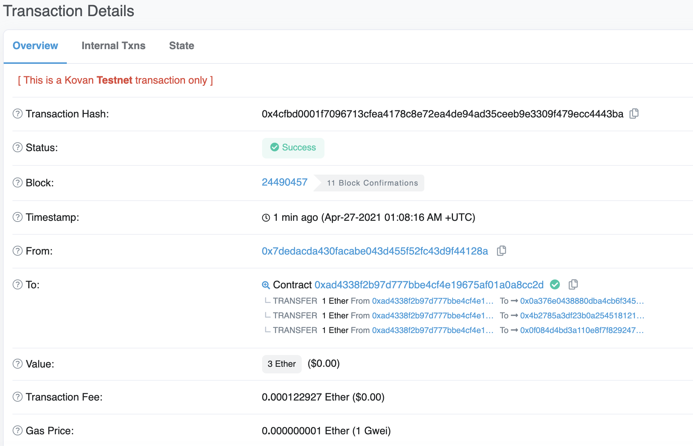

# Associate Profit Splitter

This contract will accept Ether into the contract and divide the Ether evenly among three associate level employees. This will allow the Human Resources department to pay employees quickly and efficiently.

 

## Data Dictionary:
**Three payable addresses and the owner:**
- address payable employee_one;
- address payable employee_two;
- address payable employee_three;
- address payable owner;

**function balance():**
- return the contract's current balance

**function deposit():**
- only the owner can call the function via `public payable`
- calculate the split value of the Ether between the employees
- send left over wei back to HR

**function() external payable:**
- enforce that the `deposit` function is called in the fallback function

 

## Test the contract:

### Deployed the contract to my local Ganache

 

### Balancess before the transaction:
- HR/Owner: 0x7dEDacdA430FAcABE043D455F52fc43D9F44128A
- Employee 1: 0x0a376e0438880dbA4Cb6f34547bF9310D631A3ac
- Employee 2: 0x4B2785a3dF23B0A25451812109f4bd2BcB990d79
- Employee 3: 0x0f084d4BD3A110E8f7f8292476A713592152878F

 

### Transaction amount: (split 30 ETH among the 3 employees)

 

### Balancess after the transaction:
- HR reduced 30 ETH and the employees gained 10 ETH each.

 

### Kovan Testnet + Etherscan Transaction Confirmation

